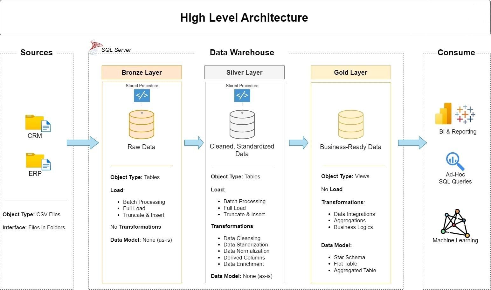

# Data Warehouse and Analytics Project

Welcome to the **Data Warehouse and Analytics Project** repository! 🚀  
This project demonstrates a comprehensive data warehousing and analytics solution, from building a data warehouse to generating actionable insights. Designed as a portfolio project, it highlights industry best practices in data engineering and analytics.

---

## 🏗️ Data Architecture

The data architecture for this project follows Medallion Architecture **Bronze**, **Silver**, and **Gold** layers:  


1. **Bronze Layer**: Stores raw data as-is from the source systems. Data is ingested from CSV Files into SQL Server Database.  
2. **Silver Layer**: This layer includes data cleansing, standardization, and normalization processes to prepare data for analysis.  
3. **Gold Layer**: Houses business-ready data modeled into a star schema required for reporting and analytics.

---

## 📖 Project Overview

This project involves:

1. **Data Architecture**: Designing a Modern Data Warehouse Using Medallion Architecture **Bronze**, **Silver**, and **Gold** layers.
2. **ETL Pipelines**: Extracting, transforming, and loading data from source systems into the warehouse.
3. **Data Modeling**: Developing fact and dimension tables optimized for analytical queries.
4. **Analytics & Reporting**: Creating SQL-based reports and dashboards for actionable insights.

---

## 🛠️ Important Links & Tools:

Everything is for Free!
- **[Datasets](datasets/):** Access to the project dataset (CSV files).
- **[SQL Server Express](https://www.microsoft.com/en-us/sql-server/sql-server-downloads):** Lightweight server for hosting your SQL database.
- **[SQL Server Management Studio (SSMS)](https://learn.microsoft.com/en-us/sql/ssms/download-sql-server-management-studio-ssms?view=sql-server-ver16):** GUI for managing and interacting with databases.
- **[Git Repository](https://github.com/):** Set up a GitHub account and repository to manage, version, and collaborate on your code efficiently.
- **[DrawIO](https://www.drawio.com/):** Design data architecture, models, flows, and diagrams.
- **[Notion Template](https://www.notion.com/templates/sql-data-warehouse-project):** Get a customizable project planning template.
- **[Notion Project Workspace](https://www.notion.so/SQL-Data-Warehouse-Project-1cc8955f9e4380928e7adb64f38d3c85):** Full access to project tasks, progress tracking, and documentation in Notion.

---

## 🚀 Project Requirements

### Building the Data Warehouse (Data Engineering)

#### Objective  
Develop a modern data warehouse using SQL Server to consolidate sales data, enabling analytical reporting and informed decision-making.

#### Specifications
- **Data Sources**: Import data from two source systems (ERP and CRM) provided as CSV files.
- **Data Quality**: Cleanse and resolve data quality issues prior to analysis.
- **Integration**: Combine both sources into a single, user-friendly data model designed for analytical queries.
- **Scope**: Focus on the latest dataset only; historization of data is not required.
- **Documentation**: Provide clear documentation of the data model to support both business stakeholders and analytics teams.

---

### BI: Analytics & Reporting (Data Analysis)

#### Objective  
Develop SQL-based analytics to deliver detailed insights into:
- **Customer Behavior**
- **Product Performance**
- **Sales Trends**

These insights empower stakeholders with key business metrics, enabling strategic decision-making.

---

## 📂 Repository Structure

```plaintext
data-warehouse-project/
│
├── datasets/                           # Raw datasets used for the project (ERP and CRM data)
│
├── docs/                               # Project documentation and architecture visuals
│   ├── Data_Flow.png                   # Visual representation of data flow
│   ├── Data_integrations.png           # Diagram of different data integrations
│   ├── Data_mart.png                   # Schema or design of data marts
│   ├── ETL_modal.png                   # Visual explanation of ETL processes
│   ├── High_level_architecture.png     # Overview of the system architecture
│   ├── Project_Notes_Sketches.pdf      # Hand-drawn notes or sketches for reference
│   ├── data_catalog.md                 # Catalog of datasets, including field descriptions and metadata
│   ├── data_layers.pdf                 # Explanation of bronze, silver, and gold layers
│   ├── naming_conventions.md           # Guidelines for consistent naming of tables, columns, and files
│
├── scripts/                            # SQL scripts for ETL and transformations
│   ├── bronze/                         # Scripts for extracting and loading raw data
│   ├── silver/                         # Scripts for cleaning and transforming data
│   ├── gold/                           # Scripts for creating analytical models
│
├── tests/                              # Test scripts and data quality validation
│
├── README.md                           # Project overview, setup instructions, and usage guide
├── LICENSE                             # License information for the repository
├── .gitignore                          # Files and directories to be ignored by Git
└── requirements.txt                    # Dependencies and requirements for the project
```

---

## 🛡️ License

This project is licensed under the [MIT License](LICENSE). You are free to use, modify, and share this project with proper attribution.

## 🌟 About Me

I'm Prakash Pandey, a BCA student who is passionate about Data Engineering, building real-world data solutions, and solving business problems with technology.

- 🔗 [Connect with me on LinkedIn](https://www.linkedin.com/in/prakash-pandey-884590263/)

